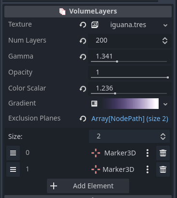

# Volume Layers for Godot

This is an addon for Godot that lets you view volumetric data, such as MRI scans.

This addon uses zipped files of 2D images as source data, so any 3D volumetric files such as.nii will need to be converted to this first.  Online programs such as https://www.onlineconverter.com/nifti-to-png can be used to convert your data.

## Installation

Copy the /addons/volume_layered_shader into your project in a directory of the same name.

Make sure the addon is enabled in the Project Settigns/Plugins window.

## Usage

Create a new instance of the addon by clicking the + button in the Scene window and selecting VolumeLayeredShader.

You can set the image volume used by clicking in the Texture field and then creating a new 3D image texture (such as a ZippedImageArchiveCpuTexture3D).  This 3D texture will supply the data used in the visualization.

The addon provides several options for Texture3D loaders:

#### ZippedImageArchiveCpuTexture3D
    - Used to load images from a zip file of images of a common image format, such as PNG or JPEG.
    - Images are presumed to all be the same size and arranged in the correct slice order.
    - Create an instance of the ZippedImageArchiveCpuTexture3D and then set the Zip File field to the file path of the zip file with your images.
    
#### ZippedImageArchiveGpuTexture3D
    - Similar to ZippedImageArchiveCpuTexture3D, but uses GPU acceleration to generate mipmaps for smoother visualization.
    - Used to load images from a zip file of images of a common image format, such as PNG or JPEG.
    - Images are presumed to all be the same size and arranged in the correct slice order.
    - Create an instance of the ZippedImageArchiveCpuTexture3D and then set the Zip File field to the file path of the zip file with your images.

#### NpyImageTexture3D
    - Load data stored in the .npy file format.
    - This is the data format used by Python's Numpy to store data arrays to disk.
    - It is a fairly simple file format, which should make it easy to generate your own files, even if you aren't using Python.
    - The NpyImageTexture3D presumes that the .npy file contains a 3D or 4D array of numerical values.
        - If 4D, the `frame` field of the NpyImageTexture3D resource can be set to indicate which 3D slice of the 4D array is to be shown.
    - [NPY website](https://numpy.org/devdocs/reference/generated/numpy.lib.format.html)

* Texture - A Texture3D that contains the volumetric data to view.
* Num Layers - The number of slices to make parallel to the camera.  The more slices, the higher the resolution.
* Gamma - Adjusts the sharpness of the texture data.  Smaller values bring out soft areas while larger values bring out hard areas.
* Opacity - Multiplies the opacity of the final pixel.
* Color Scalar - Multiplies the color of the gradient.  Used to boost the strength of the gradient.
* Gradient - Colors the pixels of the volume.  Softer values will be colored with values on the left of the gradient and harder values will be colored with values from the right side of the gradient.  It is recommended you make the left side of the gradient transparent so low density pixels are clear.
* Exclusion Planes - Any node added to this array will act as a plane that cuts away part of the model to make it easier to see the interior.  These nodes can be placed anywhere in your scene.  Marker3D is the recommended object type, but any object that extends Node3D can act as a clipping plane.

## Acknowledgments

Iguana MRI data taken from the niivue-images archive:

https://github.com/neurolabusc/niivue-images/tree/main

## Support

If you found this software useful, please consider buying me a coffee on Kofi.  Every contribution helps me to make more software:

