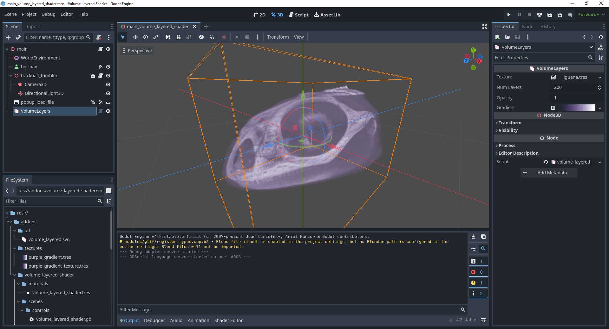

# Volume Layers for Godot

This is an addon for Godot that lets you view volumetric data, such as MRI scans.

This addon uses zipped files of 2D images as source data, so any 3D volumetric files such as.nii will need to be converted to this first.  Online programs such as https://www.onlineconverter.com/nifti-to-png can be used to convert your data.

## Installation

Copy the /addons/volume_layered_shader into your project in a directory of the same name.

Make sure the addon is enabled in the Project Settigns/Plugins window.

## Usage

Create a new instance of the addon by clicking the + button in the Scene window and selecting VolumeLayeredShader.

You can set the image volume used by clicking in the Texture field and selecting New ZippedImageArchiveCpuTexture3D.  This will create a new 3D texture object with a field called Zip File.  You can now browse to your zip file containing your texture data.

## Credits

Iguana MRI data taken from the niivue-images archive:

https://github.com/neurolabusc/niivue-images/tree/main

## Support

If you found this software useful, please consider buying me a coffee on Kofi.  Every contribution helps me to make more software:

